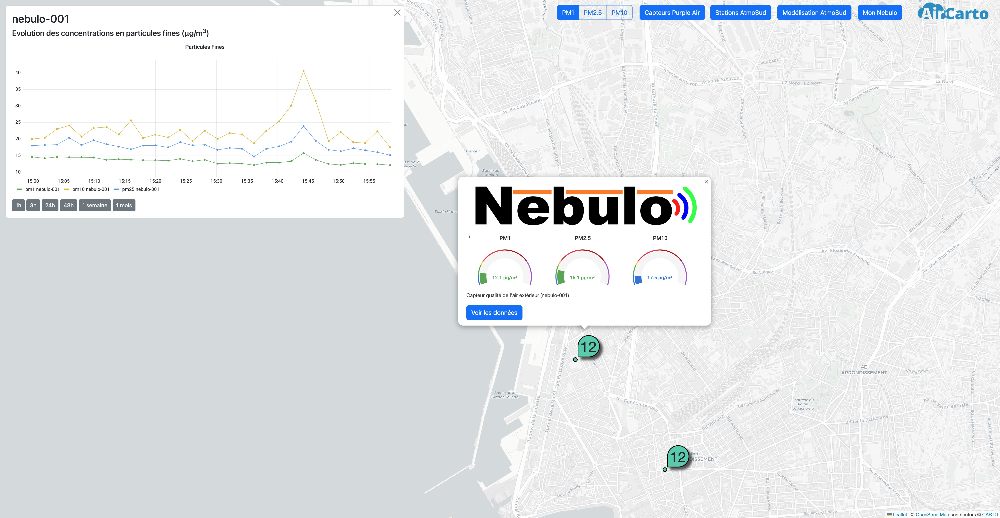

# OpenAirMap

 Map of all outdoors air quality sensors in southern France.

 Peoject developped with [AirCarto](https://www.aircarto.fr) and [AtmoSud](https://www.atmosud.org/).

 This is a javascript app running with node.js.

## Sensors

The app will get air quality data from multiples sensors and their API.

* Nebulo from AirCarto
* Purple Air
* Sensor Community
* AtmoSud

 ## Deploy

Install node.js and type `node app.js`
