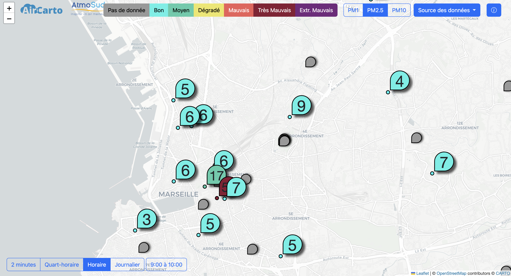
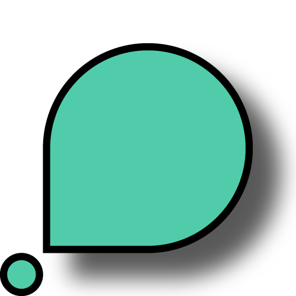
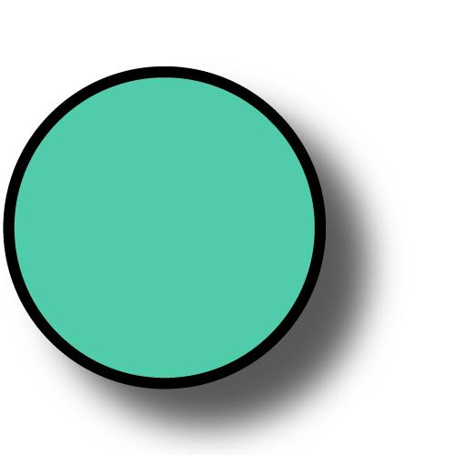
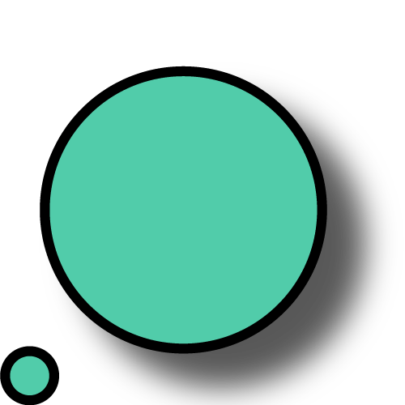
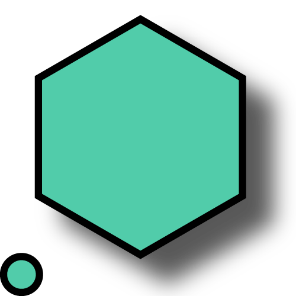
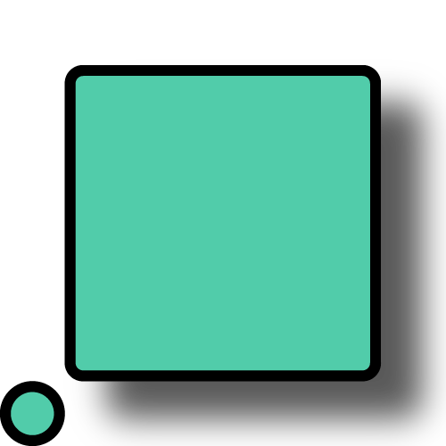

# OpenAirMap



Map of outdoors air quality sensors in southern France.

Project developped with [AirCarto](https://www.aircarto.fr) and [AtmoSud](https://www.atmosud.org/).

This webapp is available here: [openairamp.fr](https://openairmap.fr).


## Deploy

To deploy the app you need a Apache web server (Nginx not tested) with the last version of PHP and composer.

Redirect you server towards app/index.html.

To protect API token we use [PHP dotenv](https://github.com/vlucas/phpdotenv), the extension can be installed with composer, simply run `composer install` inside the project console.

You also need to add an `.env` file inside the app folder with the API keys.

```
PURPLEAIR_API_KEY="XXXXX" 
ATMOSUD_API_KEY="XXXXX"
```

You can get your Purple Air API Key here [PurpleAir Develop](https://community.purpleair.com/t/making-api-calls-with-the-purpleair-api/180). Attention PurpleAir data is no more free, you need to pay to have data credit.

You can get your AtmoSud API Key here [API AtmoSud](https://api.atmosud.org/register/form).

Attention: to ensure the security of the .env file you should verify that it is not accessible from a client side browser. 

The .htaccess should prevent access for Apache server but you need to set AllowOverride to "All" inside your Apache configuration file (apache2.conf):

```
<Directory /var/www/>
	Options Indexes FollowSymLinks
	AllowOverride All
	Require all granted
</Directory>
```

## Configuration

The JavaScript file config.js (located in the app/js_scripts folder) offers you the possibility to change some parameters (default options at startup):

* coordsCenter : center of the map (lat, long)
* compoundUpper : compounds to show (choose between PM1, PM2.5 and PM10)
* display : choose which type of sensor you want to show (can be a list)
	* nebuleair
	* sensorcommunity
	* purpleair
	* atmosudref


## Sensors

The app will get air quality data from multiples sensors and their API.

|     | Type de mesure | Icône | Pas de temps | Description | Lien vers API |
| --- | --- | --- | --- | --- | --- |
| Capteurs NebuleAir | micro-capteur |  | 2m QH H J | Micro-capteurs open source co-développés par AirCarto et AtmoSud | [AirCarto](https://aircarto.fr/API_V2/) |
| Capteurs Sensor.Community | micro-capteur |  | 2m QH H J | Micro-capteurs open source fabriqués par des citoyens bénévoles | [Sensor.Community](https://sensor.community/fr/) |
| Capteurs PurpleAir | micro-capteur |  | 2m QH H J | Micro-capteurs commercialisés par l'entreprise américaine PurpleAir Inc. | [PurpleAir](https://api.purpleair.com/) |
| Micro-stations AtmoSud | micro-capteur |  | 2m QH H J | Micro-capteurs déployés par AtmoSud | [AtmoSud](https://api.atmosud.org/) |
| Stations de référence AtmoSud | station |  | 2m QH H J | Stations de référence installées dans le cadre de la mission de surveillance de la qualité de l'air d'AtmoSud |
| Modélisation Horaire PM AtmoSud | modélisation |     | 2m QH H J | Modélisation des particules fines à l'échelle horaire sur toute la région PACA |
| Modélisation Horaire ICAIRH AtmoSud | modélisation |     | 2m QH H J | Modélisation de l'indice cumulé de la qualité de l'air (NO2, O3, PM2.5 et PM10) à l'échelle horaire sur toute la région PACA. |